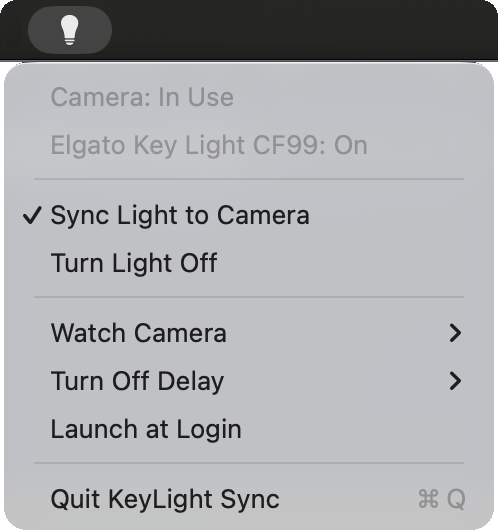

<p align="center">
  
</p>

<h1 align="center">KeyLight Sync</h1>

<p align="center">
  <b>Your key light follows your camera.</b><br>
  A tiny macOS menu bar app that turns an Elgato Key Light on when your
  camera is in use — and off when it isn't.
</p>

<p align="center">
  
  
  
  
</p>

<p align="center">
  
</p>

Built for an Opal C1 (via Opal Composer) + Elgato Key Light setup, but works
with any camera macOS recognizes and any Bonjour-discoverable Elgato light.
Zero third-party dependencies — AppKit, CoreMediaIO, and Foundation only.
Builds with just the Xcode command line tools.

## How it works

- **Camera detection** — listens to CoreMediaIO's
  `kCMIODevicePropertyDeviceIsRunningSomewhere` property on every camera
  device. This is event-driven (no polling) and fires no matter which app
  uses the camera. No camera/TCC permission is needed because the app never
  captures video — it only reads device state.
- **Light control** — discovers Elgato lights via Bonjour (`_elg._tcp`) and
  sends `PUT /elgato/lights` to the light's local HTTP API on port 9123.
  Last-known lights are persisted so control works right after launch even
  before discovery completes. Commands retry, because the light's HTTP
  server can be slow to accept connections.
- **Debounce** — turning the light *off* can be delayed (**Turn Off Delay**
  in the menu; default None) so brief camera flaps (switching between apps)
  don't flicker the light. Turning *on* is always immediate.

## The menu

- **Camera / Light status** — live state readout.
- **Sync Light to Camera** — the automatic mode (default on). Toggling it on
  immediately syncs the light to the current camera state.
- **Turn Light On / Off** — manual override.
- **Watch Camera** — "Any Camera" (default), or pin to a specific device.
  Note: Opal Composer exposes both the hardware "Opal C1" and a virtual
  "Opal Composer" camera; apps may use either, which is why "Any Camera" is
  the default.
- **Turn Off Delay** — how long the camera must stay off before the light
  turns off (None, 1.5 s, or 5 s; default None). Remembered across launches.
- **Launch at Login** — uses `SMAppService`; works best when the app is in
  /Applications.

## Build & install

```sh
make            # builds build/KeyLightSync.app
make install    # copies it to /Applications
open /Applications/KeyLightSync.app
```

On first launch macOS will ask for **Local Network** permission — approve it,
or the app can't reach the light.

To update after pulling new changes:

```sh
make reinstall  # rebuild, replace the installed app, relaunch
```

To remove everything (app, login item, preferences):

```sh
make uninstall
```

## Settings storage

Preferences (auto-sync, watched camera, turn-off delay, known lights) are
stored with `UserDefaults` in a plist named after the app's bundle identifier
in `~/Library/Preferences/`.

## License

[MIT](LICENSE)
